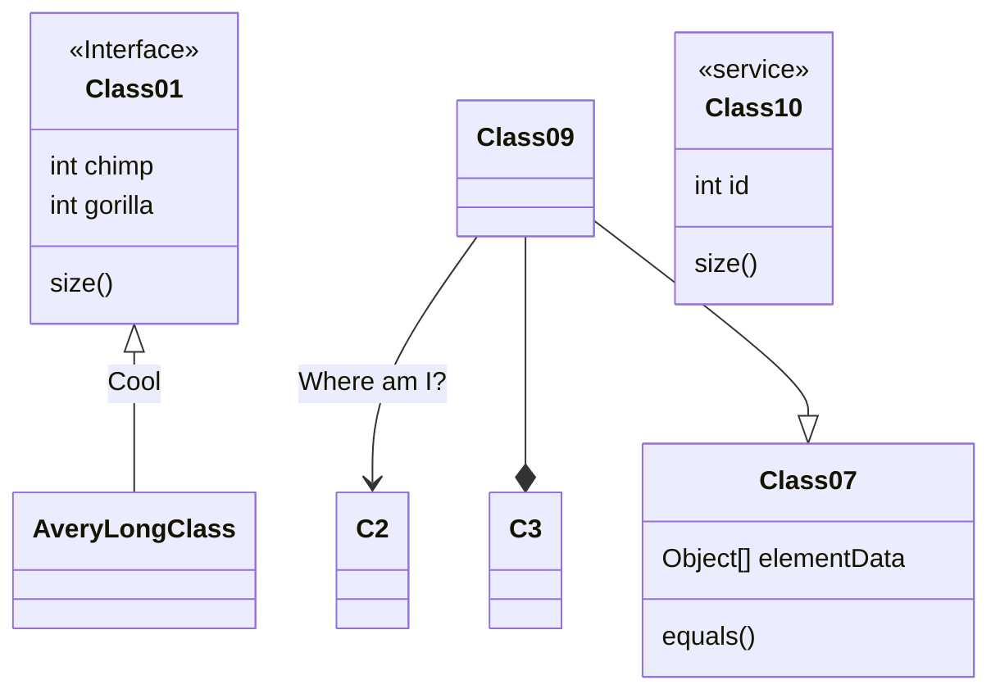

### Design

The final version of the application is hosted [here](https://master.d2a6vne2z4dg1a.amplifyapp.com)

Application is deployed [here](https://master.d2a6vne2z4dg1a.amplifyapp.com/)

### Todos

- [ ] make a meal object which you can update as a single source of truth for name and recipe
- [ ] make it harder for the meal to be created with no name (use required on the input field?)
- [ ] make the select feature so that not all the foods that are created are selected
